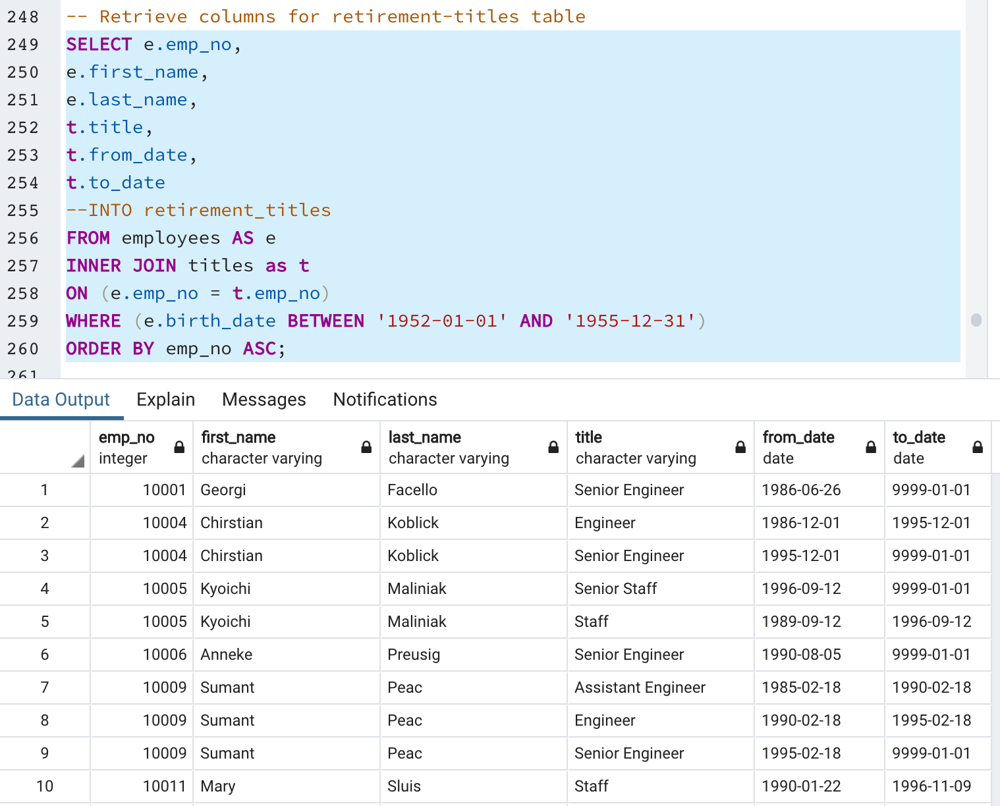

# Pewlett Hackard: Upcoming 'Silver Tsunami' Analysis

## Overview

This analysis project was performed help the executive management team of Pewlett Hackard Corporation determine the number of employees they have that will be reaching retirement age soon, determine what titles these employees hold and identify employees who are eligible to participate in a mentorship program. We used the SQL language on the PG Admin platform as well as VS Code to perform the necessary data queries and build tables to sort through the large amount of employee data provided. This analysis allowed us to provide the company's management team the information they requested.

### Resources
PG Admin SQL

VS Code

## Results

Provide a bulleted list with four major points from the two analysis deliverables. Use images as support where needed.

We started our analysis of Pewlett Hackard's employees by going through 6 data files containing data on over 300,000 employees, departments, managers as well as data on birth dates, hire dates, salaries and length of employment. We built new tables of employee data by writing queries that extract employee data based on employees' ages. The first table we created contains over 133,000 employees and closer inspection shows that it contains duplicate employees because the data provided contains all of the titles employees held while working at Pewlett Hackard and the table double counts employees that have held multiple titles during their tenure with Pewlett Hackard.

 

We then built a second query to filter out mutiple titles an employee held and return only the most recent title. This query used SQL's 'DISTINCT ON' statement and allows us to present employees nearing retirement age without duplicates.

 

This query allows us to remove over 43,000 duplicate employee titles and gives us an accurate count of unique employees nearing retirement age and group them title.

 

After determining that 90,398 employees will meet the retirement criteria set by Pewlett Hackard's management, we wrote a SQL query to find the number of employees that may be available to participate in a mentorship program (to mentor and train younger and new employees, to take over the job responsibilities of retiring employees). This query began by joining employee and department data and also title data and then selecting only the employees born in 1965 and still employed by Pewlett Hackard.

 

* Initial query shows over 133,000 employees meet the retirement age parameters set by management

* Further filtering the initial query removes over 43,000 employees that had been counted more than once due to having held more than one title during their tenure. 90,398 current PEwlett Hackard employees meet the distinct title criteria for retirement age

* Almost two thirds of those nearing retirement age hold 'Senior Engineer' of 'Senior Staff' titles

* Current employees born in 1965 that could be eligible to participate in a mentorship program based on their tenure total 1,549.

## Summary
To replace the roles that Pewlett Hackard employees will vacate by reaching retirement age, the company will have to fill 90,348 positions. While there will likely be a range of time over which the eligible employees retire, the company's management team should begin planning a strategy immediately. This quantity of employees nearing retitement is a very large proportion of the company's total workforce and replacing them will likely entail a lot of work and time.
Based on parameter of birth year of 1965, the company has 1,549 current employees that could potentially participate in a mentorship program. Considering Pewlett Hackard is a very large company that employs more than a couple hundred thousand people, management may want to consider increasing the pool of potential mentors they consider, and may look at a larger subset of employees for this mentorship program than only those currently being considered.

Additional queries could be run to determine how many more employees might become mentorship program candidates based on a broader range of ages.

Additional queries could also be written to segment the retiring employees by department and also by specific year of retirement, to better allocate resources among the departments and have a more granular timeline of when replacement employees should be hired and trained. 